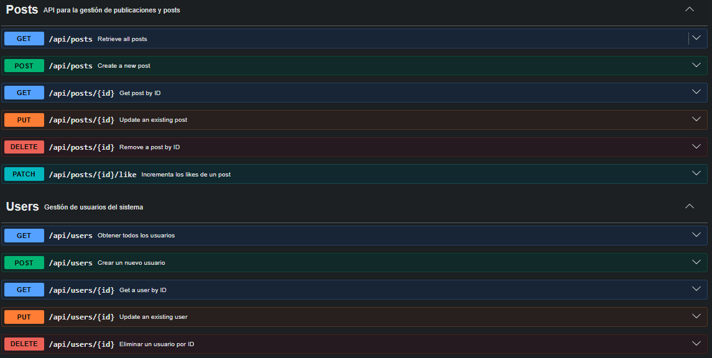

## 📖 Documentación de API - Ejemplo Node.js + Express.js
- API para la gestión de publicaciones, posts y gestión de usuarios del sistema

## 🚀 API de Ejemplo con Node.js
- Esta API demuestra cómo gestionar usuarios y posts utilizando datos en memoria (arrays).

## 🛠️ Instalación y Ejecución
- 1. Instalar dependencias: 
```bash 
    npm install 
```
- 2. Ejecutar el servidor: 
```bash
    npm run dev
```
- 3. Documentación interactiva:
```bash
    http://localhost:5000/api-docs
```

💻 Código Fuente (server.js)
```bash
    const express = require('express');
    const cors = require('cors');
    const swaggerUi = require('swagger-ui-express');
    const app = express();
    const PORT = process.env.PORT || 5000;
    const usersRouter = require('./routes/users');
    const postsRouter = require('./routes/posts');
    const swaggerSpec = require('../docs/swagger');

    // Middleware
    app.use(cors());
    app.use(express.json());

    app.use('/api-docs', swaggerUi.serve, swaggerUi.setup(swaggerSpec));

    // Routes
    app.use('/api/users', usersRouter);                 // BE-01
    app.use('/api/posts', postsRouter);                 // BE-02

    // Home route
    app.get('/', (req, res) => {
    res.json({
        message: 'CoWork Social API',
        documentation: '/api-docs',
        endpoints: {
        users: '/api/users',    // BE-01
        posts: '/api/posts'     // BE-02
        }
    });
    });
```

## 📡 Ejemplos de Uso
1. Obtener todos los posts (GET)
Petición:
GET / 
Respuesta (200 OK):
```json
{
  "posts": [
    {
      "id": 101,
      "userId": 1,
      "content": "Just finished a new microservices architecture. Feeling productive! 🚀",
      "likes": 42,
      "createdAt": "2024-03-01T10:30:00Z"
    },
    {
      "id": 102,
      "userId": 2,
      "content": "Accessibility is not a feature, it's a right. Designing for everyone today.",
      "likes": 128,
      "createdAt": "2024-03-02T14:15:00Z"
    }
    ]
}
```

2. Crear un nuevo usuario (POST)
Petición:
POST /posts/ 
```json
    {
    "title": "New Project Idea",
    "content": "A collaborative platform for developers."
    }
```
Respuesta (201 Created):
```json
    {
    "id": 11,
    "title": "New Project Idea",
    "content": "A collaborative platform for developers.",
    "createdAt": "Thu Apr 02 2026"
    }
```

## 🚀 Deploy
- Link al API: `https://tu-api.onrender.com`
- Link a docs: `https://tu-api.onrender.com/api-docs`

## 📝 Screenshots de Swagger
- Aquí se muestran las capturas de pantalla de la interfaz de Swagger:
<div style="width:500px; height:500px; border-radius:8px; display:block; margin:auto;">



</div>