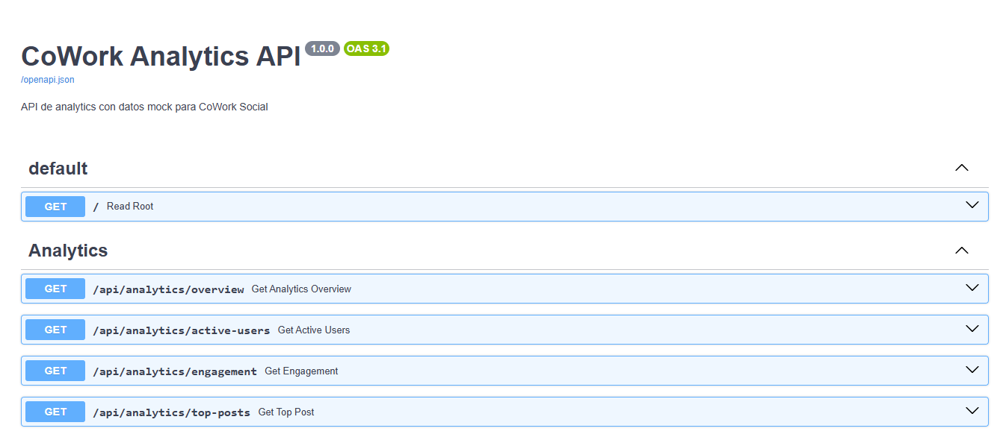

## 🚀 Deploy
- Link al API: `https://tu-api.onrender.com`
- Link a docs: `https://tu-api.onrender.com/api-docs`

## 📝 Screenshots de Swagger
- Aquí se muestran las capturas de pantalla de la interfaz de Swagger:
<div style="width:500px; height:500px; border-radius:8px; display:block; margin:auto;">



</div>

- Ejemplos de responses
```json
curl -X 'GET' \
  'http://127.0.0.1:8000/api/analytics/overview' \
  -H 'accept: application/json'
```
- Server response
```json
{
  "total_users": 2823,
  "total_posts": 1297,
  "total_comments": 2796,
  "avg_engagement_rate": 7.7
}
```